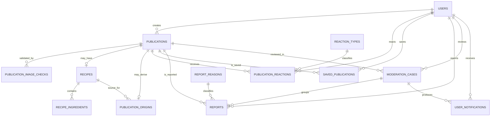

# Rede Social de Comida — Modelagem do Banco de Dados

> Documento técnico independente das regras de negócio. O documento de regras permanece como fonte funcional e não será alterado durante esta etapa.

## 1. Controle do documento

| Campo | Valor |
|---|---|
| Status | Modelagem lógica inicial |
| Versão | 0.8 |
| Última atualização | 07/08/2026 |
| Banco alvo | PostgreSQL 17 |
| Backend alvo | Java 25 + Spring Boot 4 + REST |
| Responsáveis | Fagner e ChatGPT |

### Convenções

- **Definido:** consequência direta de uma regra de negócio aprovada.
- **Proposta técnica:** decisão recomendada para a implementação, ainda sujeita à validação.
- **Em aberto:** decisão necessária antes do modelo físico ou da implementação.
- Os nomes físicos estão em inglês e `snake_case`.
- Os exemplos de tipos representam PostgreSQL.

---

## 2. Objetivos da modelagem

1. Representar usuários, publicações, receitas, reações, itens salvos e moderação.
2. Garantir no banco as regras de unicidade e integridade que não dependem somente da aplicação.
3. Evitar tabelas e estruturas de funcionalidades fora do MVP.
4. Permitir evolução futura sem antecipar categorias, seguidores, nutrição, comentários ou mensagens.
5. Manter a imagem fora do PostgreSQL, armazenando somente sua referência e metadados essenciais.

## 3. Decisões técnicas gerais — propostas

### 3.1 Identificadores — definido

Usar UUID v4 como chave primária, gerado pela aplicação antes da persistência com `UUID.randomUUID()`.

Motivos:

- evita expor uma sequência previsível nas URLs;
- permite criar objetos antes da transação de persistência;
- mantém o mesmo padrão entre entidades públicas e internas.

### 3.2 Datas e horários

Usar `timestamptz`, sempre persistido em UTC. Conversões para o fuso do usuário pertencem à camada de apresentação.

### 3.3 Valores categóricos

Usar `varchar` com restrições `CHECK` para categorias pequenas e estáveis, como papel do usuário, tipo e visibilidade da publicação.

Usar tabelas de domínio para valores administráveis ou sujeitos a evolução, como tipos de reação e motivos de denúncia.

### 3.4 Imagens — definido

Não armazenar a imagem como `bytea`. Os arquivos serão armazenados no Google Cloud Storage. O PostgreSQL guardará o bucket, o nome imutável do objeto, sua geração e metadados essenciais.

Não guardar URLs assinadas: elas expiram e devem ser geradas sob demanda. A identidade persistente do arquivo será composta por `gcs_bucket`, `gcs_object_name` e `gcs_generation`.

### 3.4.1 Acesso às imagens — definido

Usar inicialmente um único bucket privado. A API gera URLs assinadas de leitura ao montar as respostas:

- publicações `PUBLIC`: a URL pode ser gerada mesmo para visitantes;
- publicações `INTERNAL`: a URL só é gerada após autenticação;
- publicações não ativas: a URL fica restrita aos fluxos administrativos autorizados.

Isso mantém a regra de visibilidade na aplicação e evita URLs públicas permanentes para conteúdo interno. A validade inicial será de uma hora.

“Assinada” significa que a URL recebe uma autorização criptográfica temporária. Não há assinatura visual ou marca-d’água na foto. O backend gera o link depois de verificar o acesso, o navegador busca o arquivo diretamente no GCS e o link deixa de funcionar quando expira.

### 3.5 Exclusões — definido

O comportamento normal será desativação ou exclusão lógica. Registros não serão removidos fisicamente apenas porque deixaram de aparecer na interface.

Ao excluir a conta, o usuário deverá escolher entre:

1. **Excluir somente a conta:** anonimizar e desativar o usuário, mantendo suas publicações atribuídas a uma conta removida.
2. **Excluir a conta e as publicações:** remover fisicamente o usuário, suas publicações, imagens no GCS e dados dependentes.

Na segunda opção, versões criadas por outras pessoas não serão apagadas. Se a receita inspiradora for removida fisicamente, o vínculo técnico poderá ficar sem a FK de origem, mas conservará `source_title_snapshot` para exibir “Receita original indisponível”.

As FKs e rotinas de limpeza deverão distinguir dados pertencentes ao usuário de conteúdo independente criado por terceiros.

### 3.5.1 Convenção de desativação

- Entidades principais que possam desaparecer da interface usam `status`, `active` ou `deleted_at`, conforme sua função.
- Associações reversíveis, como reação e item salvo, mantêm a linha e preenchem `deleted_at`; uma nova ativação limpa esse campo.
- Catálogos administráveis usam `active`.
- A remoção física fica restrita ao fluxo explícito **Excluir conta e publicações** e às rotinas técnicas de descarte de arquivos órfãos ou rejeitados.

### 3.6 Histórico

O MVP não terá tabela de versões de publicação ou receita. Edições substituem o estado atual, mantendo somente `updated_at`.

### 3.7 Formatos e processamento de imagem — definido

- Entrada aceita: JPEG, PNG e WebP.
- Tamanho máximo do upload: 5 MB.
- Resolução máxima de entrada: 20 megapixels.
- O backend normaliza a imagem final para WebP.
- O maior lado da imagem final terá no máximo 1.600 pixels.
- Cada publicação mantém exatamente uma imagem final.
- A validação inicial usará Google Cloud Vision para `FOOD` e `PERSON`.
- Resultado `UNCERTAIN` seguirá para análise administrativa, sem rejeição automática.
- Buckets separados por ambiente: `<app>-dev-images` e `<app>-prod-images`, inicialmente em `us-east1`.
- URLs assinadas de leitura terão validade inicial de uma hora.

### 3.8 Paginação — definido

- As coleções do MVP usarão paginação por número de página.
- A API será indexada a partir de `1`: `page=1` representa a primeira página.
- O tamanho padrão será de 20 itens e o máximo aceito será 50.
- A configuração do Spring será `spring.data.web.pageable.one-indexed-parameters=true`.
- O `Pageable` permanece internamente indexado a partir de zero; a conversão da requisição ocorre na camada web.
- A API não retornará `Page` diretamente. Um DTO próprio devolverá `page = page.getNumber() + 1`, garantindo numeração iniciada em 1 também na resposta.
- Feed, busca, perfil, salvos, notificações e moderação obedecerão ao mesmo contrato.
- Se a paginação por deslocamento se tornar instável ou cara com o crescimento do feed, uma futura versão poderá adotar cursor sem alterar a ordenação do banco.

---

## 4. Visão geral dos relacionamentos

`APP_CONFIG` é uma tabela de configuração única e foi omitida do diagrama para reduzir ruído.

---

## 5. Entidades e campos

## 5.1 `users`

Conta, autenticação, identidade pública mínima e configuração do usuário.

| Campo | Tipo proposto | Nulo | Regra |
|---|---|---:|---|
| `id` | `uuid` | Não | Chave primária |
| `email` | `varchar(254)` | Sim | Opcional no MVP e único quando informado |
| `blocked_username_hmac` | `char(64)` | Sim | Impressão criptográfica do username original quando a conta for bloqueada |
| `password_hash` | `varchar(255)` | Não | Nunca armazenar senha em texto puro |
| `username` | `varchar(30)` | Não | Único, público e sem diferenciar maiúsculas e minúsculas |
| `display_name` | `varchar(100)` | Não | Nome exibido publicamente |
| `role` | `varchar(20)` | Não | `USER` ou `ADMIN`; padrão `USER` |
| `status` | `varchar(20)` | Não | `ACTIVE`, `BLOCKED` ou `DELETED` |
| `blocked_by` | `uuid` | Sim | FK para o administrador que bloqueou a conta |
| `blocked_at` | `timestamptz` | Sim | Data do bloqueio administrativo |
| `block_reason` | `text` | Sim | Justificativa administrativa obrigatória no bloqueio |
| `show_reaction_counts` | `boolean` | Não | Padrão `true` |
| `created_at` | `timestamptz` | Não | Data de criação |
| `updated_at` | `timestamptz` | Não | Última alteração |
| `deleted_at` | `timestamptz` | Sim | Preenchido quando houver exclusão lógica |

### Restrições

- `UNIQUE (lower(email))` por índice funcional.
- `UNIQUE (lower(username))` por índice funcional.
- Índice único parcial em `blocked_username_hmac WHERE blocked_username_hmac IS NOT NULL`.
- `CHECK (role IN ('USER', 'ADMIN'))`.
- `CHECK (status IN ('ACTIVE', 'BLOCKED', 'DELETED'))`.
- `block_reason` terá no máximo 2.000 caracteres.
- Quando `status = 'BLOCKED'`, `blocked_by`, `blocked_at`, `block_reason` e `blocked_username_hmac` serão obrigatórios.
- Usuários bloqueados continuam existindo para preservar autoria e moderação.

### Usuário bloqueado

- Não poderá autenticar, publicar, reagir, salvar ou denunciar.
- Suas publicações existentes continuam visíveis, salvo decisão administrativa específica sobre cada conteúdo.
- Sua identidade pública será anonimizada e exibida como `Conta removida`.
- E-mail e username serão substituídos por valores técnicos aleatórios, e a senha será invalidada.
- Antes da substituição, o username normalizado será transformado em HMAC e salvo em `blocked_username_hmac`.
- Um novo cadastro calcula o mesmo HMAC e rejeita o username se houver correspondência em uma conta bloqueada.
- Não será usado hash simples do username, pois valores previsíveis seriam vulneráveis a enumeração; a chave do HMAC fica fora do banco.

### Exclusão da conta

- Na opção **Excluir somente a conta**, o registro muda para `DELETED`, credenciais deixam de funcionar e dados identificáveis são anonimizados. As publicações permanecem.
- Uma conta excluída pelo próprio usuário não conserva `blocked_username_hmac`; portanto, seu username poderá ser usado novamente.
- Na opção **Excluir conta e publicações**, uma rotina de expurgo remove fisicamente a conta e seus dados dependentes depois de confirmar a escolha do usuário.
- A forma exata dos valores substitutos de e-mail e username será definida no modelo físico; eles não poderão revelar os valores anteriores.

### Não será criado no MVP

- tabela de perfil separada;
- avatar ou foto;
- biografia, localização ou especialidades;
- estatísticas agregadas no perfil;
- confirmação de e-mail, até decisão contrária.

---

## 5.2 `publications`

Entidade central que representa `DISH`, `RECIPE` ou `MY_VERSION`.

| Campo | Tipo proposto | Nulo | Regra |
|---|---|---:|---|
| `id` | `uuid` | Não | Chave primária |
| `author_id` | `uuid` | Não | FK para `users.id` |
| `type` | `varchar(20)` | Não | `DISH`, `RECIPE` ou `MY_VERSION` |
| `visibility` | `varchar(20)` | Não | `PUBLIC` ou `INTERNAL` |
| `title` | `varchar(255)` | Sim | Opcional em prato; obrigatório em receita; comporta título composto |
| `description` | `text` | Sim | Texto opcional; máximo de 2.000 caracteres na aplicação |
| `gcs_bucket` | `varchar(222)` | Não | Nome do bucket privado |
| `gcs_object_name` | `varchar(1024)` | Não | Nome imutável do objeto no bucket |
| `gcs_generation` | `bigint` | Não | Geração específica retornada pelo Cloud Storage |
| `image_format` | `varchar(20)` | Não | Formato validado, como `jpg`, `png` ou `webp` |
| `image_size_bytes` | `bigint` | Não | Tamanho retornado e validado no upload |
| `image_width` | `integer` | Não | Largura em pixels |
| `image_height` | `integer` | Não | Altura em pixels |
| `status` | `varchar(30)` | Não | `PENDING_VALIDATION`, `ACTIVE`, `UNDER_REVIEW`, `HIDDEN`, `REJECTED` ou `REMOVED` |
| `published_at` | `timestamptz` | Sim | Preenchido ao ficar `ACTIVE`; usado na ordenação do feed |
| `created_at` | `timestamptz` | Não | Data de criação |
| `updated_at` | `timestamptz` | Não | Última edição permitida |
| `deleted_at` | `timestamptz` | Sim | Preenchido na exclusão lógica |

### Restrições

- `CHECK (type IN ('DISH', 'RECIPE', 'MY_VERSION'))`.
- `CHECK (visibility IN ('PUBLIC', 'INTERNAL'))`.
- `UNIQUE (gcs_bucket, gcs_object_name)`; sobrescrita não será permitida.
- `CHECK (gcs_generation > 0)`.
- `CHECK (status IN ('PENDING_VALIDATION', 'ACTIVE', 'UNDER_REVIEW', 'HIDDEN', 'REJECTED', 'REMOVED'))`.
- `CHECK (image_size_bytes > 0)`.
- `CHECK (image_width > 0 AND image_height > 0)`.
- A aplicação não disponibilizará operação para alterar bucket, objeto ou geração após a publicação.
- Somente publicações `ACTIVE` aparecem normalmente no feed, busca e perfil público.
- `UNDER_REVIEW` representa ocultação preventiva automática depois de três denúncias; o conteúdo continua acessível apenas ao administrador responsável pela análise.
- O título escrito para um prato ou receita comum terá no máximo 150 caracteres. O campo físico aceita 255 para comportar o título composto de `MY_VERSION`.
- `description` terá no máximo 2.000 caracteres.

### Validações entre entidades

Algumas regras não cabem em um `CHECK` simples e deverão ser garantidas transacionalmente pela aplicação ou, se necessário, por gatilho:

- `RECIPE` deve possuir registro ativo em `recipes`.
- `DISH` não deve possuir receita ativa; pode conservar um registro desativado após conversão.
- `MY_VERSION` deve possuir uma origem em `publication_origins`.
- `MY_VERSION` também deve possuir sua própria receita completa em `recipes`.
- A origem deve apontar para uma publicação que possua receita.

### Conversão entre prato e receita — definido

- Uma publicação `DISH` pode se tornar `RECIPE` quando o autor adicionar ingredientes e modo de preparo válidos.
- Uma publicação `RECIPE` pode se tornar `DISH`; a receita e seus ingredientes ficam logicamente desativados e deixam de aparecer no frontend, sem exclusão física.
- Se o autor voltar a transformar o prato em receita, os dados anteriores poderão ser reativados e editados.
- A imagem original continua imutável em todas as conversões.
- Uma publicação `MY_VERSION` pode se tornar `DISH`; a receita fica desativada, mas `publication_origins` e o título composto são preservados para homenagear a receita original.
- A publicação convertida continua contando em **Fiz também**, pois a origem histórica permanece válida.
- Se o autor reativar a receita, o tipo volta a `MY_VERSION`, preservando ingredientes, preparo e origem anteriores para edição.

---

## 5.2.1 `publication_image_checks` — proposta técnica

Registra resultados de validação da imagem sem acoplar o banco a um único fornecedor ou modelo de inteligência artificial.

| Campo | Tipo proposto | Nulo | Regra |
|---|---|---:|---|
| `id` | `uuid` | Não | Chave primária |
| `publication_id` | `uuid` | Não | FK para `publications.id` |
| `check_type` | `varchar(30)` | Não | `FOOD`, `PERSON` ou `AI_GENERATED` |
| `provider` | `varchar(50)` | Não | Ex.: `CLOUDINARY_AI_VISION`, `GOOGLE_VISION` |
| `attempt_number` | `smallint` | Não | Número da tentativa, iniciando em 1 |
| `status` | `varchar(20)` | Não | `APPROVED`, `REJECTED`, `UNCERTAIN` ou `ERROR` |
| `confidence` | `numeric(5,4)` | Sim | Confiança normalizada entre 0 e 1, quando disponível |
| `provider_reference` | `varchar(255)` | Sim | Referência técnica da análise |
| `error_code` | `varchar(100)` | Sim | Código técnico quando houver falha do provedor |
| `next_retry_at` | `timestamptz` | Sim | Próxima tentativa programada |
| `requires_manual_review` | `boolean` | Não | `true` após resultado incerto ou terceira falha |
| `checked_at` | `timestamptz` | Não | Data da validação |

### Comportamento proposto

- Uma publicação nasce como `PENDING_VALIDATION`.
- O MVP executa ao menos as verificações `FOOD` e `PERSON`.
- `AI_GENERATED` pode ficar `UNCERTAIN` até existir uma solução suficientemente confiável.
- A publicação muda para `ACTIVE` somente depois das validações obrigatórias.
- Resultado incerto ou erro técnico não deve ser tratado automaticamente como fraude; poderá exigir nova tentativa ou validação administrativa.
- Falhas técnicas terão no máximo três tentativas, cada uma persistida separadamente.
- Na terceira falha, ou em resultado `UNCERTAIN`, `requires_manual_review` será marcado como `true`.
- O retorno bruto completo do fornecedor não será persistido indefinidamente. Logs técnicos poderão ter retenção curta.

### Restrições propostas

- `UNIQUE (publication_id, check_type, provider, attempt_number)`.
- `CHECK (attempt_number BETWEEN 1 AND 3)`.
- `CHECK (confidence IS NULL OR confidence BETWEEN 0 AND 1)`.

---

## 5.3 `recipes`

Extensão opcional e `1:1` de uma publicação.

| Campo | Tipo proposto | Nulo | Regra |
|---|---|---:|---|
| `publication_id` | `uuid` | Não | PK e FK para `publications.id` |
| `yield_quantity` | `numeric(10,2)` | Sim | Quantidade produzida |
| `yield_unit` | `varchar(50)` | Sim | Ex.: porções, unidades, gramas |
| `instructions` | `text` | Não | Modo de preparo em texto puro |
| `active` | `boolean` | Não | `true` enquanto a receita estiver visível como receita |
| `created_at` | `timestamptz` | Não | Data de criação |
| `updated_at` | `timestamptz` | Não | Última edição |
| `deleted_at` | `timestamptz` | Sim | Desativação lógica da parte de receita |

### Restrições

- `CHECK (yield_quantity IS NULL OR yield_quantity > 0)`.
- Se `yield_quantity` for informado, `yield_unit` também deve ser informado.
- `instructions` não pode ser vazio ou composto somente por espaços.
- `instructions` terá no máximo 10.000 caracteres.
- O título da receita permanece em `publications.title`, evitando duplicação.
- A imagem permanece em `publications`, pois pertence à publicação.

### Apresentação do preparo

O autor escreverá um passo por linha em um único campo de texto. O frontend poderá separar as linhas, ignorar linhas vazias e apresentá-las como uma lista numerada. O banco preserva o conteúdo original e não mantém entidades individuais para cada passo.

---

## 5.4 `recipe_ingredients`

Ingredientes livres, estruturados e ordenados dentro de uma receita.

| Campo | Tipo proposto | Nulo | Regra |
|---|---|---:|---|
| `id` | `uuid` | Não | Chave primária |
| `recipe_id` | `uuid` | Não | FK para `recipes.publication_id` |
| `position` | `smallint` | Não | Ordem de apresentação, iniciando em 1 |
| `name` | `varchar(150)` | Não | Nome livre do ingrediente |
| `quantity` | `numeric(12,3)` | Sim | Pode ser nulo para “a gosto” |
| `unit` | `varchar(50)` | Sim | Unidade livre no MVP |
| `note` | `varchar(255)` | Sim | Ex.: picado, peneirado, opcional |
| `deleted_at` | `timestamptz` | Sim | Remoção lógica do ingrediente |

### Restrições

- Índice único parcial em `(recipe_id, position) WHERE deleted_at IS NULL`.
- `CHECK (position > 0)`.
- `CHECK (quantity IS NULL OR quantity > 0)`.
- Pelo menos um ingrediente por receita, garantido no caso de uso de publicação.

### Decisão de escopo

Não haverá catálogo central de ingredientes no MVP. O nome será texto livre. Isso simplifica o cadastro, mas uma futura nutrição exigirá normalização ou mapeamento posterior.

---

## 5.5 `publication_origins`

Relaciona uma publicação `MY_VERSION` à receita que a inspirou.

| Campo | Tipo proposto | Nulo | Regra |
|---|---|---:|---|
| `derived_publication_id` | `uuid` | Não | PK e FK para `publications.id` |
| `source_recipe_id` | `uuid` | Sim | FK para `recipes.publication_id`; pode ficar nula após expurgo da origem |
| `source_title_snapshot` | `varchar(150)` | Não | Título da receita original no momento da criação |
| `title_suffix` | `varchar(100)` | Não | Complemento obrigatório escrito pelo autor da versão |
| `change_summary` | `text` | Sim | Resumo opcional das alterações |
| `created_at` | `timestamptz` | Não | Data do vínculo |

### Restrições

- A publicação derivada não pode apontar para si mesma.
- Uma publicação derivada possui apenas uma origem no MVP.
- A existência do registro é obrigatória para `MY_VERSION`.
- A publicação derivada deve possuir sua própria receita, ingredientes, modo de preparo e imagem.
- A FK de origem usará `ON DELETE SET NULL` no expurgo físico; o snapshot permanece obrigatório.

### Título proposto

O nome exibido será formado pelo título original como prefixo e um complemento obrigatório do autor. Exemplo:

`Lasanha à bolonhesa — versão com berinjela`

`source_title_snapshot` preserva o prefixo existente no momento da criação, mesmo que a receita original seja renomeada depois. O título completo continuará materializado em `publications.title` para facilitar busca e ordenação. A aplicação controla a composição e permite que o autor altere somente o sufixo.

O sufixo é obrigatório e o formato inicial será `{título original} — {sufixo}`.

---

## 5.6 `reaction_types`

Catálogo dos tipos de reação disponíveis.

| Campo | Tipo proposto | Nulo | Regra |
|---|---|---:|---|
| `id` | `smallint generated by default as identity` | Não | Chave primária |
| `code` | `varchar(50)` | Não | Identificador técnico único |
| `label` | `varchar(80)` | Não | Texto apresentado ao usuário |
| `active` | `boolean` | Não | Padrão `true` |
| `display_order` | `smallint` | Não | Ordenação na interface |

### Carga inicial

| `code` | `label` |
|---|---|
| `WOULD_EAT` | Eu comeria |
| `WANT_TO_MAKE` | Quero fazer |
| `COMFORT_FOOD` | Comida afetiva |

**Fiz também** não será um tipo persistido nesta tabela. É uma ação da interface que inicia o fluxo de criação de `MY_VERSION`. A quantidade exibida será derivada dos vínculos existentes em `publication_origins`.

Essa quantidade ficará sempre visível e não será afetada por `users.show_reaction_counts`, pois representa publicações derivadas existentes, não reações recebidas.

---

## 5.7 `publication_reactions`

Associação entre usuário, publicação e tipo de reação.

| Campo | Tipo proposto | Nulo | Regra |
|---|---|---:|---|
| `publication_id` | `uuid` | Não | FK para `publications.id` |
| `user_id` | `uuid` | Não | FK para `users.id` |
| `reaction_type_id` | `smallint` | Não | FK para `reaction_types.id` |
| `created_at` | `timestamptz` | Não | Data da reação |
| `deleted_at` | `timestamptz` | Sim | Remoção lógica ao desfazer a reação |

### Chave e regras

- PK composta: `(publication_id, user_id, reaction_type_id)`.
- O mesmo usuário pode aplicar reações diferentes à mesma publicação.
- O mesmo usuário não pode repetir o mesmo tipo de reação.
- Reações inativas permanecem referenciáveis para não apagar o histórico existente.
- Clicar novamente em uma reação aplicada funciona como alternância: preenche `deleted_at`. Reaplicar limpa `deleted_at`.

---

## 5.8 `saved_publications`

Lista privada de publicações salvas pelo usuário.

| Campo | Tipo proposto | Nulo | Regra |
|---|---|---:|---|
| `user_id` | `uuid` | Não | FK para `users.id` |
| `publication_id` | `uuid` | Não | FK para `publications.id` |
| `created_at` | `timestamptz` | Não | Data em que foi salvo |
| `deleted_at` | `timestamptz` | Sim | Remoção lógica da lista de salvos |

### Chave e regras

- PK composta: `(user_id, publication_id)`.
- A lista é visível somente para seu proprietário.
- Salvar novamente deve ser idempotente, não criar duplicidade.
- Remover da lista preenche `deleted_at`; salvar de novo reativa a mesma associação.

---

## 5.9 `report_reasons`

Catálogo dos motivos de denúncia.

| Campo | Tipo proposto | Nulo | Regra |
|---|---|---:|---|
| `id` | `smallint generated by default as identity` | Não | Chave primária |
| `code` | `varchar(50)` | Não | Identificador técnico único |
| `label` | `varchar(120)` | Não | Texto apresentado ao usuário |
| `active` | `boolean` | Não | Padrão `true` |
| `display_order` | `smallint` | Não | Ordenação na interface |

### Carga inicial

- `NOT_FOOD`
- `IDENTIFIABLE_PERSON`
- `OFFENSIVE_OR_DISCRIMINATORY`
- `UNAUTHORIZED_ADVERTISING`
- `AUTHORSHIP_VIOLATION`
- `DANGEROUS_OR_ILLEGAL`

---

## 5.10 `reports`

Denúncia individual criada por um usuário autenticado.

| Campo | Tipo proposto | Nulo | Regra |
|---|---|---:|---|
| `id` | `uuid` | Não | Chave primária |
| `publication_id` | `uuid` | Não | FK para `publications.id` |
| `reporter_id` | `uuid` | Não | FK para `users.id` |
| `reason_id` | `smallint` | Não | FK para `report_reasons.id` |
| `description` | `text` | Sim | Explicação opcional escrita por quem denunciou |
| `moderation_case_id` | `uuid` | Sim | Preenchido quando agrupada em um caso |
| `resolution` | `varchar(20)` | Não | `PENDING`, `UPHELD` ou `REJECTED`; padrão `PENDING` |
| `created_at` | `timestamptz` | Não | Data da denúncia |
| `resolved_at` | `timestamptz` | Sim | Data da decisão administrativa |

### Restrições definidas

- `UNIQUE (publication_id, reporter_id)`: um usuário denuncia cada publicação no máximo uma vez.
- `CHECK (resolution IN ('PENDING', 'UPHELD', 'REJECTED'))`.
- O autor não pode denunciar a própria publicação.
- A denúncia exige um motivo estruturado e permite uma descrição livre opcional.
- A aplicação limitará a descrição a 1.000 caracteres e rejeitará texto vazio ou composto somente por espaços.
- Uma ou duas denúncias não alteram a visibilidade da publicação.
- Ao alcançar três denúncias pendentes, a publicação passa para `UNDER_REVIEW` e deixa imediatamente as áreas públicas até a decisão administrativa.
- `REJECTED` significa que a denúncia não foi acolhida após a análise; isso não afirma, isoladamente, que houve má-fé do denunciante.

---

## 5.11 `moderation_cases`

Fila administrativa aberta quando a publicação alcança o limite configurado de denúncias ainda não agrupadas.

| Campo | Tipo proposto | Nulo | Regra |
|---|---|---:|---|
| `id` | `uuid` | Não | Chave primária |
| `publication_id` | `uuid` | Não | FK para `publications.id` |
| `status` | `varchar(20)` | Não | `PENDING`, `KEPT`, `HIDDEN` ou `REMOVED` |
| `report_count_at_open` | `integer` | Não | Quantidade que abriu o caso |
| `opened_at` | `timestamptz` | Não | Entrada na fila |
| `reviewed_by` | `uuid` | Sim | FK para `users.id`; deverá ser `ADMIN` |
| `reviewed_at` | `timestamptz` | Sim | Data da decisão |
| `decision_note` | `text` | Sim | Justificativa administrativa interna |

### Restrições e comportamento

- Apenas um caso `PENDING` por publicação, garantido por índice único parcial.
- Abertura do caso e associação das denúncias devem ocorrer na mesma transação.
- `reviewed_by` e `reviewed_at` ficam nulos enquanto o caso estiver `PENDING`.
- `report_count_at_open > 0`.
- O caso é aberto com três denúncias e a publicação passa para `UNDER_REVIEW` na mesma transação.
- Se a decisão for `KEPT`, a publicação volta para `ACTIVE`, as denúncias agrupadas recebem resolução `REJECTED` e cada denunciante recebe um aviso.
- Se a decisão for `HIDDEN` ou `REMOVED`, as denúncias agrupadas recebem resolução `UPHELD` e a publicação permanece fora das áreas públicas.
- A tela da fila, os detalhes das denúncias e as ações de decisão serão acessíveis somente a usuários `ADMIN`.
- `decision_note` terá no máximo 2.000 caracteres.
- A justificativa será opcional em `KEPT` e obrigatória em `HIDDEN` ou `REMOVED`.

---

## 5.12 `app_config`

Configuração única da aplicação, evitando uma estrutura genérica de chave e valor sem tipagem.

| Campo | Tipo proposto | Nulo | Regra |
|---|---|---:|---|
| `id` | `smallint` | Não | PK; valor fixo `1` |
| `report_threshold` | `integer` | Não | Limite para ocultar preventivamente e enviar à fila; valor inicial `3` |
| `daily_report_limit` | `integer` | Não | Máximo de denúncias criadas por usuário em 24 horas; valor inicial `10` |
| `updated_by` | `uuid` | Sim | FK para `users.id` |
| `updated_at` | `timestamptz` | Não | Última alteração |

### Restrições

- `CHECK (id = 1)` para manter uma única configuração.
- `CHECK (report_threshold > 0)`.
- `CHECK (daily_report_limit > 0)`.
- O valor inicial será `3`.
- Atingir o limite abre um caso e oculta preventivamente a publicação com `UNDER_REVIEW`; isso não representa decisão ou punição definitiva.
- Cada usuário poderá criar no máximo 10 denúncias em uma janela móvel de 24 horas.

---

## 5.13 `user_notifications`

Avisos persistentes exibidos ao usuário dentro da aplicação.

| Campo | Tipo proposto | Nulo | Regra |
|---|---|---:|---|
| `id` | `uuid` | Não | Chave primária |
| `user_id` | `uuid` | Não | FK para `users.id` |
| `type` | `varchar(40)` | Não | Inicialmente `REPORT_REJECTED_WARNING` |
| `moderation_case_id` | `uuid` | Sim | Caso que originou o aviso |
| `publication_id` | `uuid` | Sim | Publicação relacionada, quando ainda existir |
| `created_at` | `timestamptz` | Não | Data do aviso |
| `read_at` | `timestamptz` | Sim | Data em que o usuário visualizou |
| `deleted_at` | `timestamptz` | Sim | Remoção lógica da caixa de avisos |

### Comportamento inicial

- `UNIQUE (user_id, moderation_case_id, type)` evita avisos duplicados para a mesma decisão.
- `CHECK (type IN ('REPORT_REJECTED_WARNING'))` enquanto esse for o único tipo disponível.
- Quando um caso termina como `KEPT`, será criada uma notificação para cada denunciante cujas denúncias foram rejeitadas.
- O texto apresentado informará que a publicação foi aprovada e que denúncias repetidamente rejeitadas podem levar à desativação da conta.
- A notificação não desativa a conta automaticamente.
- O aviso não informará uma quantidade de ocorrências permitidas antes da desativação.
- No MVP, o administrador consultará o histórico de denúncias rejeitadas e decidirá manualmente pelo bloqueio, sem limite automático divulgado ou aplicado.
- O texto poderá ser montado pelo frontend a partir de `type`; não é necessário repetir a mensagem completa em cada linha.

---

## 6. Regras de integridade consolidadas

| ID | Regra | Camada principal |
|---|---|---|
| DB-001 | E-mail único sem diferenciar caixa | Índice PostgreSQL |
| DB-002 | Username único sem diferenciar caixa | Índice PostgreSQL |
| DB-003 | Uma foto obrigatória por publicação | `NOT NULL` + aplicação |
| DB-004 | Foto não pode ser substituída após publicação | Caso de uso/autorização |
| DB-005 | Receita é extensão `1:1` da publicação | PK/FK em `recipes` |
| DB-006 | Ingredientes possuem ordem única e o preparo é texto obrigatório | `UNIQUE`, `NOT NULL` e validação |
| DB-007 | `MY_VERSION` possui uma receita de origem | Transação/aplicação |
| DB-008 | Uma reação de cada tipo por usuário/publicação | PK composta |
| DB-009 | Um salvamento por usuário/publicação | PK composta |
| DB-010 | Uma denúncia por usuário/publicação | `UNIQUE` |
| DB-011 | Um único caso pendente por publicação | Índice único parcial |
| DB-012 | Três denúncias pendentes ocultam preventivamente e enviam o conteúdo para análise | Transação/aplicação |
| DB-013 | Contagens são exibidas conforme configuração do autor | Consulta/autorização |
| DB-014 | Visitantes acessam somente conteúdo `PUBLIC` e `ACTIVE` | Consulta/autorização |
| DB-015 | Usuários autenticados acessam `PUBLIC` e `INTERNAL`, se `ACTIVE` | Consulta/autorização |
| DB-016 | Cada objeto do Cloud Storage pertence a no máximo uma publicação | `UNIQUE (gcs_bucket, gcs_object_name)` |
| DB-017 | Publicação só recebe `published_at` após aprovação das validações obrigatórias | Transação/aplicação |
| DB-018 | Quantidade de versões permanece visível mesmo quando reações estão ocultas | Consulta |
| DB-019 | Reagir novamente com o mesmo tipo desfaz logicamente a reação | Aplicação + `deleted_at` |
| DB-020 | `DISH` e `RECIPE` podem ser convertidos sem apagar os dados de receita | Transação + exclusão lógica |
| DB-021 | Expurgo da receita original preserva versões de terceiros e o snapshot do título | FK `ON DELETE SET NULL` + aplicação |
| DB-022 | Aprovar conteúdo em análise o reativa e rejeita as denúncias agrupadas | Transação/aplicação |
| DB-023 | Cada denunciante recebe aviso quando o conteúdo denunciado é aprovado | `user_notifications` + transação |
| DB-024 | `MY_VERSION` convertido em `DISH` mantém origem, título e contagem histórica | Aplicação + `publication_origins` |
| DB-025 | Usuário pode criar no máximo dez denúncias em 24 horas | Aplicação + consulta indexada |
| DB-026 | Conta bloqueada fica anônima publicamente e seu e-mail não pode ser recadastrado | HMAC + índice único + aplicação |
| DB-027 | Conta excluída voluntariamente libera o e-mail para novo cadastro | Fluxo de anonimização |
| DB-028 | Paginação REST começa em `page=1`, com 20 itens por padrão e máximo de 50 | Configuração web + validação |

---

## 7. Índices iniciais — propostas

### 7.1 Identidade

- Índice único em `lower(users.email)`.
- Índice único em `lower(users.username)`.

### 7.2 Feed cronológico

- `(published_at DESC, id DESC)` parcial para publicações `ACTIVE` e `PUBLIC`.
- `(published_at DESC, id DESC)` parcial para todas as publicações `ACTIVE`, usado no feed autenticado.

O `id` funciona como desempate determinístico entre publicações com o mesmo `published_at`. O MVP usará paginação por deslocamento; a consistência absoluta entre páginas durante novas inserções não é requisito inicial.

### 7.3 Perfil

- `(author_id, published_at DESC, id DESC)` parcial para publicações `ACTIVE`.

### 7.4 Busca

- Índice para busca textual em `publications.title`.
- Índice para busca textual em `recipe_ingredients.name`.
- Avaliar `pg_trgm` com índices GIN para buscas parciais e sem diferenciar caixa.

### 7.5 Relacionamentos e moderação

- Índices em todas as FKs que não façam parte inicial de uma PK composta.
- Índice em `publication_origins(source_recipe_id)` para consultar e contar versões derivadas.
- Índice em `reports(publication_id)` para contagem de denúncias.
- Índice em `reports(reporter_id, resolution, created_at DESC)` para histórico de denúncias rejeitadas.
- Índice em `reports(reporter_id, created_at DESC)` para aplicar o limite de dez denúncias em 24 horas.
- Índice único parcial em `moderation_cases(publication_id) WHERE status = 'PENDING'`.
- Índice em `moderation_cases(status, opened_at)` para a fila do administrador.
- Índice em `user_notifications(user_id, created_at DESC) WHERE deleted_at IS NULL` para a caixa de avisos.

---

## 8. Fluxos transacionais importantes

## 8.1 Criar prato

1. Validar usuário, visibilidade e metadados básicos.
2. Enviar a imagem ao bucket privado do Google Cloud Storage por um fluxo autorizado.
3. Consultar os metadados do objeto e capturar bucket, nome, geração, formato, tamanho e dimensões.
4. Inserir `publications` com `type = 'DISH'` e `status = 'PENDING_VALIDATION'`.
5. Executar e persistir as validações obrigatórias da imagem.
6. Se aprovadas, alterar para `ACTIVE` e preencher `published_at`.
7. Se rejeitadas, alterar para `REJECTED` e agendar a exclusão do objeto no Cloud Storage.
8. Em falha antes da persistência, remover o ativo órfão ou enviá-lo para rotina de limpeza.

## 8.2 Criar receita

1. Validar publicação, rendimento, ingredientes e modo de preparo.
2. Armazenar a imagem no Cloud Storage e verificar seus metadados.
3. Inserir `publications` com `type = 'RECIPE'` e `status = 'PENDING_VALIDATION'`.
4. Inserir `recipes`.
5. Inserir ingredientes ordenados; o preparo permanece em `recipes.instructions`.
6. Confirmar tudo em uma única transação de banco.
7. Executar as validações da imagem e ativar ou rejeitar a publicação.

## 8.3 Criar “Minha versão”

1. Validar a existência e disponibilidade da receita de origem.
2. Receber a imagem, ingredientes, preparo e complemento do título da nova versão.
3. Criar `publications` com `type = 'MY_VERSION'` e título completo composto pela aplicação.
4. Criar `publication_origins`, preservando o título original em `source_title_snapshot`.
5. Criar obrigatoriamente `recipes`, ingredientes e preparo próprios.
6. Executar o mesmo fluxo de validação e ativação da imagem.

### Ação “Fiz também”

1. O usuário seleciona **Fiz também** em uma receita.
2. A interface informa que será necessário cadastrar sua própria receita.
3. Após a confirmação, abre o formulário de `MY_VERSION` com a origem definida e o título original como prefixo.
4. Nenhuma reação ou contagem é criada enquanto o formulário não for concluído.
5. Após a publicação, o vínculo em `publication_origins` passa a compor a quantidade de pessoas que fizeram sua versão.

## 8.4 Reagir

1. Validar usuário e publicação acessível.
2. Se não existir associação, inserir pela chave composta.
3. Se existir ativa, preencher `deleted_at` para desfazer.
4. Se existir desativada, limpar `deleted_at` para reaplicar.

## 8.5 Denunciar e abrir caso

1. Validar motivo e descrição opcional.
2. Recusar se o denunciante já tiver criado dez denúncias nas últimas 24 horas.
3. Inserir a denúncia garantindo unicidade permanente entre usuário e publicação.
4. Contar denúncias ainda não associadas a um caso, usando bloqueio transacional adequado.
5. Se três denúncias foram atingidas e não existe caso pendente, criar `moderation_cases` e alterar a publicação para `UNDER_REVIEW`.
6. Associar as denúncias consideradas ao novo caso.
7. Retirar imediatamente a publicação do feed, busca e perfil público enquanto o administrador analisa.

### Nova denúncia após aprovação

- Quem já denunciou a publicação não poderá denunciá-la novamente.
- Outros usuários ainda poderão denunciar.
- Somente denúncias novas e ainda não agrupadas contarão para abrir outro caso.
- Um novo conjunto de três denúncias poderá ocultar preventivamente a publicação outra vez.

## 8.6 Aprovar conteúdo denunciado

1. Validar que o responsável possui papel `ADMIN` e que o caso está `PENDING`.
2. Alterar o caso para `KEPT` e registrar administrador, data e justificativa.
3. Alterar as denúncias agrupadas para `REJECTED` e preencher `resolved_at`.
4. Alterar a publicação de `UNDER_REVIEW` para `ACTIVE`.
5. Criar uma notificação `REPORT_REJECTED_WARNING` para cada denunciante.
6. Confirmar alterações em uma única transação para impedir que conteúdo volte sem os avisos correspondentes.

## 8.7 Ocultar ou remover conteúdo denunciado

1. Validar administrador e caso pendente.
2. Alterar o caso para `HIDDEN` ou `REMOVED`.
3. Alterar as denúncias agrupadas para `UPHELD` e preencher `resolved_at`.
4. Alterar a publicação para o estado correspondente e mantê-la fora das áreas públicas.

## 8.8 Falha na validação automática da imagem

1. Manter a publicação em `PENDING_VALIDATION` durante falhas técnicas do provedor.
2. Realizar até três tentativas automáticas com intervalos progressivos.
3. Persistir cada tentativa em `publication_image_checks`.
4. Depois da terceira falha, marcar a validação como pendente de análise administrativa.
5. Não rejeitar nem publicar automaticamente enquanto o resultado não for confiável.

---

## 9. Exclusão e retenção

### 9.1 Usuário excluído

O fluxo apresentará duas escolhas:

1. **Excluir somente a conta:** anonimizar e desativar o usuário, mantendo as publicações visíveis e exibindo o autor como conta removida.
2. **Excluir conta e publicações:** executar expurgo físico da conta, de suas publicações e dos dados dependentes, além de remover seus objetos no GCS.

### 9.2 Publicação comum excluída pelo autor

Fora do expurgo completo da conta, a publicação será marcada como removida e ficará invisível no frontend. O banco não apagará fisicamente seus dados.

### 9.3 Receita com versões derivadas

Na exclusão lógica, a receita original fica indisponível, mas o vínculo técnico continua existente. No expurgo físico, `publication_origins.source_recipe_id` fica nulo e o snapshot permite mostrar “Receita original indisponível”. As versões de terceiros continuam publicadas.

### 9.4 Moderação

Na exclusão lógica, casos e denúncias permanecem. No expurgo físico solicitado pelo usuário, os registros diretamente dependentes de sua conta ou de suas publicações também serão removidos. Antes da produção deverá ser verificado se alguma retenção mínima é exigida por segurança, prevenção de abuso ou obrigação legal.

---

## 10. Estruturas deliberadamente ausentes

Não serão criadas no MVP:

- comentários;
- mensagens ou conversas;
- seguidores;
- categorias, temas ou marcadores;
- ranking e conteúdo em alta;
- nutrição;
- perfis profissionais;
- múltiplas imagens por publicação;
- versões históricas de receita;
- catálogo normalizado de ingredientes;
- estatísticas agregadas de perfil.

---

## 11. Decisões necessárias antes do modelo físico

1. ~~Confirmar `uuid` como padrão de identificador.~~ **Resolvido:** todas as entidades principais usarão `uuid`.
2. ~~Confirmar a criação de `recipe_steps` ou escolher texto único em `recipes`.~~ **Resolvido:** o preparo será armazenado em `recipes.instructions` como texto puro, com um passo por linha.
3. ~~Definir se `MY_VERSION` terá receita própria completa ou apenas foto e resumo.~~ **Resolvido:** será uma receita completa ligada à receita inspiradora.
4. ~~Definir se `MADE_IT_TOO` será também uma reação persistida ou somente uma ação de criação.~~ **Resolvido:** será somente uma ação que inicia `MY_VERSION`; a contagem virá de `publication_origins`.
5. ~~Confirmar uma denúncia por usuário/publicação.~~ **Resolvido:** cada usuário poderá denunciar uma publicação uma única vez.
6. ~~Definir o valor inicial de `report_threshold`.~~ **Resolvido:** três denúncias pendentes ocultam preventivamente a publicação e abrem o caso.
7. ~~Definir o comportamento ao clicar novamente em uma reação já aplicada.~~ **Resolvido:** o segundo clique desfaz logicamente a reação.
8. ~~Definir o tratamento de receita original excluída quando houver versões.~~ **Resolvido:** as versões permanecem e usam o snapshot; no expurgo, a FK de origem fica nula.
9. ~~Definir limites de tamanho, formatos e dimensões de imagem.~~ **Resolvido:** JPEG/PNG/WebP, 5 MB e 20 MP na entrada; WebP com lado máximo de 1.600 px na saída.
10. ~~Escolher o armazenamento inicial das imagens.~~ **Resolvido:** Google Cloud Storage.
11. ~~Confirmar se haverá e-mail no cadastro e se será usado para login.~~ **Resolvido:** no MVP, username e senha serão usados no cadastro e login; o e-mail permanece opcional no banco e não participa da autenticação.
12. ~~Definir se a exclusão do usuário anonimiza ou remove suas publicações.~~ **Resolvido:** o usuário escolherá entre manter publicações anonimizadas ou excluir fisicamente conta e publicações.
13. ~~Definir se o prefixo de `MY_VERSION` permanece como fotografia do título original ou acompanha futuras renomeações.~~ **Resolvido:** o snapshot fica congelado.
14. ~~Definir se o complemento do título de `MY_VERSION` será obrigatório e qual separador será usado.~~ **Resolvido:** sufixo obrigatório com travessão: `{original} — {sufixo}`.
15. ~~Escolher o primeiro provedor de validação `FOOD` e `PERSON`.~~ **Resolvido:** Google Cloud Vision.
16. ~~Definir o comportamento para validação `UNCERTAIN` ou indisponibilidade do provedor.~~ **Resolvido:** `UNCERTAIN` vai para análise administrativa; falhas técnicas recebem três tentativas antes de seguir para a fila.
17. ~~Definir a validade das URLs assinadas de leitura.~~ **Resolvido:** uma hora.
18. ~~Confirmar região e nome do bucket.~~ **Resolvido:** `us-east1`, com buckets separados `<app>-dev-images` e `<app>-prod-images`; o nome real do aplicativo substituirá o placeholder.
19. ~~Definir se a configuração que oculta contagens de reações também ocultará a quantidade de versões em **Fiz também**.~~ **Resolvido:** a quantidade de versões ficará sempre visível.
20. ~~Definir se uma publicação `MY_VERSION` poderá ser convertida em `DISH`.~~ **Resolvido:** poderá; origem e título permanecem, e a publicação continua contando como versão.
21. ~~Definir a política de nova tentativa quando o provedor de validação de imagem estiver indisponível.~~ **Resolvido:** três tentativas com intervalos progressivos e posterior análise administrativa.
22. ~~Definir o valor substituto e a estratégia de liberação de e-mail e username na anonimização da conta.~~ **Resolvido:** valores técnicos aleatórios; exclusão voluntária libera o e-mail, bloqueio conserva HMAC impeditivo.
23. ~~Definir se a desativação por denúncias repetidamente rejeitadas será manual.~~ **Resolvido para o MVP:** aviso sem quantidade explícita e decisão administrativa manual.
24. ~~Definir a paginação do MVP.~~ **Resolvido:** páginas REST começam em 1, com tamanho padrão 20 e máximo 50.

---

## 12. Plano preliminar de migrations

Depois da validação deste documento:

1. `V1__create_users_and_app_config.sql`
2. `V2__create_publications_and_recipes.sql`
3. `V3__create_reactions_and_saved_publications.sql`
4. `V4__create_reports_and_moderation.sql`
5. `V5__create_indexes.sql`
6. `V6__seed_reaction_types_and_report_reasons.sql`

As migrations só deverão ser escritas após as decisões da seção 11, evitando consolidar hipóteses como estrutura definitiva.
