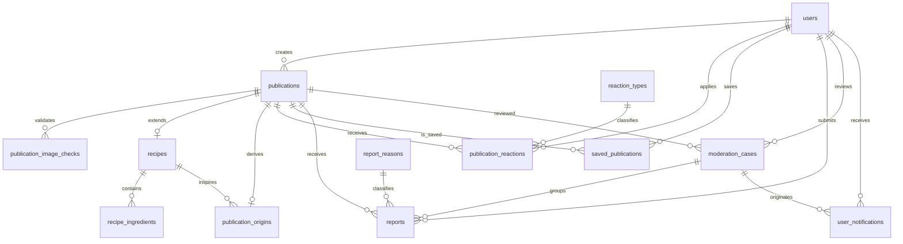

# ComeSebebes — Modelo físico PostgreSQL

## Escopo

Modelo físico aprovado para PostgreSQL 17. O banco mantém integridade estrutural; autorização, transições de estado, limites temporais e fluxos transacionais ficam na aplicação.

## Diagrama ER

## Decisões físicas

- Entidades principais usam `uuid`; catálogos usam `smallint identity`.
- Datas usam `timestamptz` e o valor padrão é `now()`.
- `recipes` usa somente `deleted_at` para desativação lógica.
- `publications.status` é a fonte principal do estado; `deleted_at` registra exclusão lógica.
- Não existem triggers, funções ou regras de autorização no banco.
- A origem de uma `MY_VERSION` usa `ON DELETE SET NULL`, preservando o snapshot do título.
- Imagens finais são WebP no GCS; o PostgreSQL guarda apenas a referência e os metadados.
- `Fiz também` não é catálogo de reação: é uma ação que cria uma origem de `MY_VERSION`.

## Migrations

1. `V1__create_users_and_app_config.sql`
2. `V2__create_publications_and_recipes.sql`
3. `V3__create_reactions_and_saved_publications.sql`
4. `V4__create_reports_and_moderation.sql`
5. `V5__create_indexes.sql`
6. `V6__seed_reaction_types_and_report_reasons.sql`
